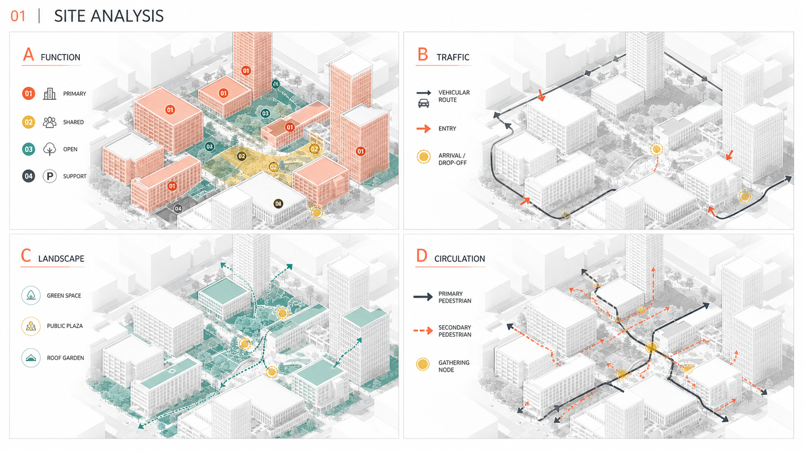

# architecture-mapping-zh

中文建筑、景观与城市设计竞赛分析图 Skill。通过 MoE 专家路由、RAG 证据链、
Constraint DSL、Style Tokens 和模型提示词编译，完成图纸分析、风格研究与受约束制图。

当前版本：**0.3.0**

## 0.3.0 更新

- 新增 Pinterest 景观分析图研究管线，只提取用户可见的 Pin 主图与来源元数据。
- 新增可恢复采集、缩略图下载、SHA-256/pHash 去重、质量门槛和运行状态报告。
- 从景观建筑分析图中提炼 8 个可选视觉风格簇：
  - 极简灰白竞赛制图
  - 生态淡彩叠图
  - 低饱和纸张拼贴
  - 精细矢量分析图
  - 分层景观轴测图
  - 诊断热区叠图
  - 手绘混合媒介
  - 暗底高对比叙事图
- 新增 `style_cluster=auto`，根据图纸类型、子型、投影和媒介自动选择风格。
- 新增 low / medium / high 三档风格强度。
- Pinterest 风格接入 RAG 检索、风格版式、模型生产、程序校验和质量评审专家。
- 为 Gemini/Nano Banana、GPT Image、Midjourney 分别编译模型专用提示词。
- 图像处理依赖改为按需加载；仅生成提示词时无需安装 `imagehash` 等图片处理模块。
- Pinterest 风格默认关闭，不改变原有 Skill 行为。

## 核心能力

- 十专家 MoE 路由与 3–7 轮制作简报门槛
- F0–F3 几何忠实度与 D0–D4 图像细节等级
- 九类主分类、56 个子型及多标签 JSON Schema
- 图底关系、版式、色板、线型、符号和中文后期系统
- 全面反推与仅风格反推
- Constraint DSL 生产前、交付前双重校验
- 来源可追溯的 RAG 检索和至少两个不同参考来源
- Gemini、GPT Image、Midjourney 三模型提示词编译
- Eval/Rubric Loop 与硬否决质量评审

## Pinterest 风格调用

Pinterest 数据集风格为显式可选能力：

```json
{
  "style_source": "pinterest_dataset",
  "style_cluster": "auto",
  "style_strength": 0.7
}
```

也可以指定具体风格：

```json
{
  "style_source": "pinterest_dataset",
  "style_cluster": "ecological_layered_wash",
  "style_strength": 0.7
}
```

风格只控制媒介、边缘、纹理、阴影、色板、图底和版式，不得覆盖 F2/F3 几何、
真实 GIS 数据、用户锁定项或证据链，也不得复制参考项目的场地、道路、文字和设计内容。

## 案例演示

下面展示一组场地分析轴测图。图面以统一基底分别表达功能、交通、景观与步行流线，
使用低饱和灰白背景、珊瑚橙与青绿色语义色、清晰图例和分区编号。



> 案例图片用于展示 Skill 的图面组织与提示词方向，不代表真实项目数据或 GIS 结论。

## 数据管线

```powershell
python scripts/pipeline_v030.py ingest-browser-batch --root <dataset> --input <batch.json>
python scripts/pipeline_v030.py collection-status --root <dataset>
python scripts/pipeline_v030.py quality-gate --root <dataset>
python scripts/pipeline_v030.py compile-prompts --root <dataset> `
  --style-source pinterest_dataset `
  --style-cluster ecological_layered_wash `
  --style-strength 0.7
```

运行时数据保存在工作区的 `architecture-mapping-zh-runtime/`，不打包进 Skill，
也不提交 Pinterest 缩略图、JSONL 记录或运行时索引。

## 安全边界

- 只读取用户已登录页面中可见的公开内容。
- 不读取 Cookie、密码或 Local Storage。
- 不绕过 CAPTCHA、登录墙、限流或访问控制。
- 连续无新增、出现 CAPTCHA 或访问异常时停止采集。
- 不长期保存 Pinterest 高清原图。
- 不把视觉相似性当作场地事实或设计证据。

## Pilot 质量门槛

进入扩量前至少人工复核 100 张样本，并满足：

- 相关率 ≥ 90%
- 缩略图下载成功率 ≥ 90%
- 近重复漏检率 ≤ 5%
- JSON Schema 通过率 = 100%

当前 v0.3 数据管线的 Pilot 与回归测试均已通过。
